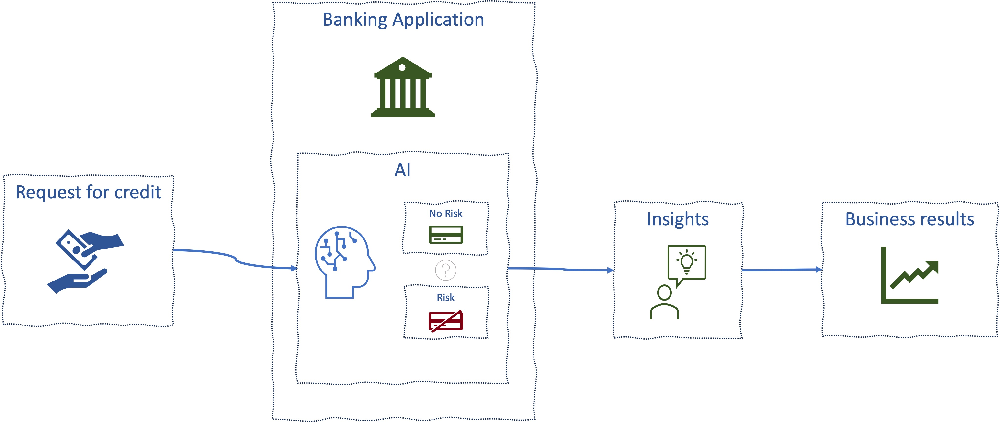
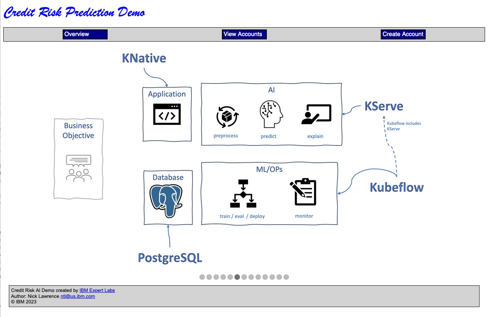
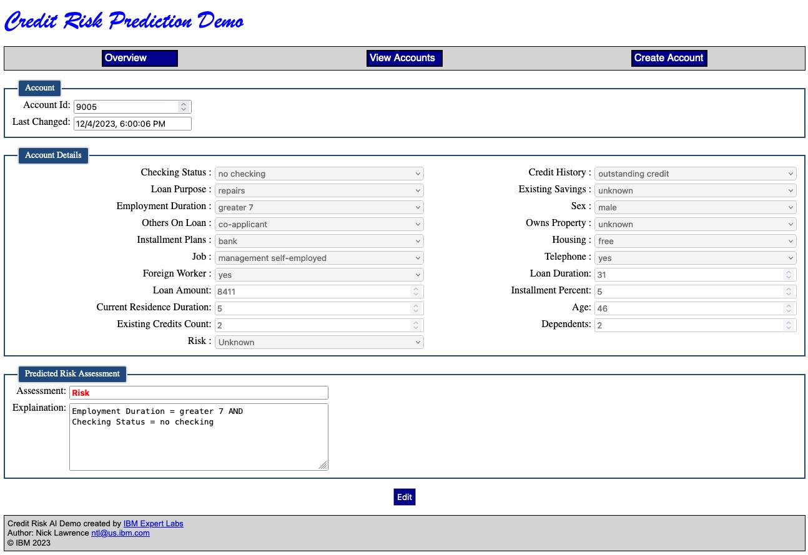
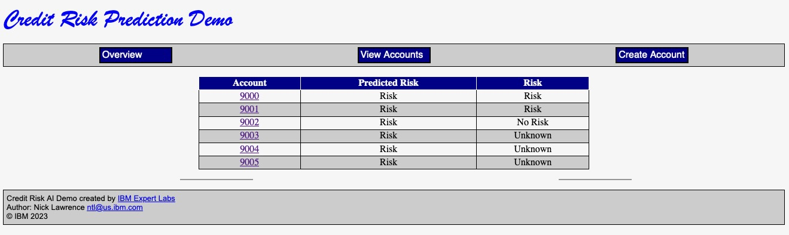
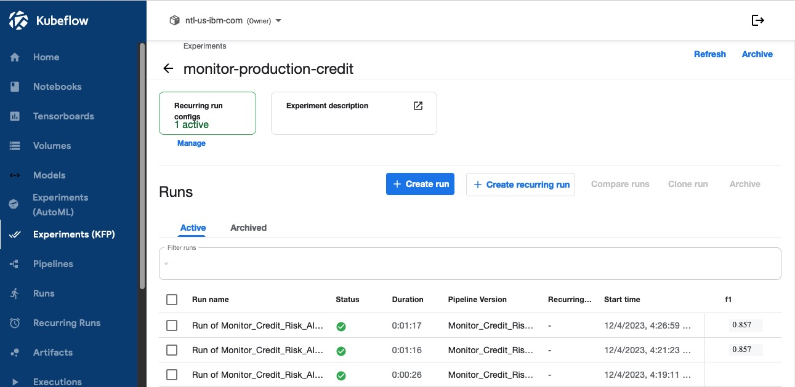
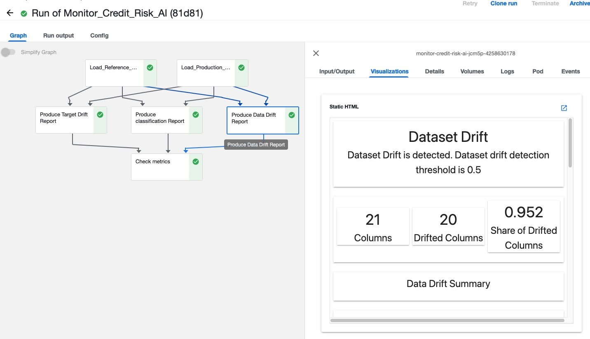
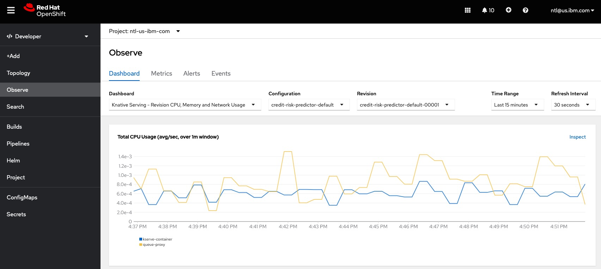

# Overview
This folder contains an example where an application is integrated with responsible AI. In this example, tabular information about an account is provided to an AI model, which makes a "Risk" or "No Risk" prediction for the account. The prediction is then used to make informed decisions which will improve the business results of a fictitious bank.

In order for this AI use case to be responsible, the example needs to include a few important features:
* The process used to train, test, and deploy the model must be documented and repeatable.
  * The model must be free from bias
  * We must provide metrics for our training and test process if audited.
* For accounts that are flagged as a risk, we need an explaination of why the model predicted "Risk".
* Post deployment, model performance must be monitored.
  * We must be able to determine if/when data drift has occurred.
  * we must be able to report performance metrics in production
* The application must be "well engineered"
  * Able to scale as user demand changes
  * Able to be monitored (CPU & Memory usage)

## About the dataset
This example uses the German Credit Risk dataset, which can be obtained from the IBM Cloud [here](https://dataplatform.cloud.ibm.com/samples). You can create an IBM account for free to access the data.

The data is designed to be used as sample data for exploring IBM data science and AI tools. Models trained from this data are not suitable for real world applications, but the dataset is a wonderful resource for education and training use cases.

The data is distributed under an [MIT License](https://opensource.org/licenses/MIT).

# Installation Guide
Because this example describes how to integrate AI into an application, it is slightly more complicated to deploy than other examples.

The assumption is that the environment is deployed on
* Red Hat OpenShift 4.12 running on IBM Power.
* Kubeflow 1.7 or newer
* IBM Power 9 or newer hardware

The container images in this example run a newer version of Python from RocketCE with is optimized for IBM Power. These images only run on Power 9 or newer hardware.

The steps to deploy the application are outlined in this section.

## Install / Configure Database
The application and train/eval/deploy pipelines both require an SQL database. The example includes multiple options for the database:
* PostgreSQL database running on OpenShift
* DB2 running on IBM Cloud

Follow the directions in README.md within the subdirectory for the database of your choice. You only need to setup one type of database.
## Build container images
If container images are not already built, you can build them by following the instructions in the `container_image` directory.

## Run Train/Eval/Deploy model pipeline
The `Deploy_Model_Pipeline.ipnb` notebook uploads and executes a pipeline to train, test, and deploy the model. The deployment includes a predictor, transformer, and explainer component.

You may need to make the following adjustments to the notebook:
1. The URLs for the images may need to be changed to the most recent versions of the images (espeically if new images have been build).
1. The notebook defines multiple components for loading data
   * load_df_from_db2
   * load_df_from_postgresql

   The credit_model_pipeline cell needs to be changed so that the two tasks use the correct component for the database.
   * load_training_data_task
   * load_test_data_task
   
   These tasks also need to be changed so that the correct method is called to add the right credentials for the database.
   * add_db2_connection_secrets
   * add_pg_connection_secrets
   
Run the notebook to start the pipeline. The notebook flow will synchronize with the pipeline.

In the graph of the pipeline has several important visualizations.
   * The Data Quality Report task includes a visualization for the quality of data.
   * The Configure Tensorboard task includes a visualization with a link to a tensorboard that monitors training in real time.
   * The train component has a visualization that shows the precision-recall trade off for training data.
   * The evaluate component has a visualization that shows metrics for how the model performed on the test data.
   
   
   
## Deploy Application
The deploy model pipeline deploys the inference service, but does not deploy the application. The application can be deployed from the command line, using one of the included yaml files.

* To deploy the model with a DB2 database, use the `deploy_app_db2.yaml` file. 
* To deploy the model with a PostgreSQL database, use the `deploy_app_postgresql.yaml` file.

You may need to make the following changes to the yaml file:
* The image may need to be changed to the most current image, expecially if you have rebuilt the application container image.
* The PREDICT_URL and EXPLAIN_URL environment variables may need to be updated to the namespace where the inference service is deployed.
* The annotations for autoscaling may need to be modified (if you want the application to dynamically scale).
  * autoscaling.knative.dev/max-scale
  * autoscaling.knative.dev/min-scale
  * autoscaling.knative.dev/target

You can deploy the application using the command `oc apply -f <filename>`.

Deploying the application creates a KNative route to access the application. You retrieve the URL for the application with this command:

`oc get ksvc demo-application -oyaml | yq -r '.status.address.url'`

## Create model monitoring recurring pipeline
In this step, we setup a recurring pipeline to detect data drift monitor the performance of the AI model.

The pipeline is uploaded and executed in the `Deploy_Model_Monitoring.ipynb` notebook.

There are a few things in the notebook that may need to be changed:
* The base image needs to be set to the workflow image, this may need to be changed if you have rebuilt the container images.

1. The notebook defines multiple components for loading data
   * load_df_from_db2
   * load_df_from_postgresql

   The monitor_credit_model_pipeline cell needs to be changed so that the two tasks use the correct component for the database.
   * load_training_data_task
   * load_test_data_task
   
   These tasks also need to be changed so that the correct method is called to add the right credentials for the database.
   * add_db2_connection_secrets
   * add_pg_connection_secrets

   The pipeline is compiled and uploaded. After the upload, a recurring run is created.
   The recurring run happens every Monday-Friday at the top of the hour.
   
   You can delete recurring runs using the UI, or from the command line with the command:
   `oc delete scheduledworkflows --all`
   
   The CRON syntax is described here: https://pkg.go.dev/github.com/robfig/cron#hdr-CRON_Expression_Format
   
# Using the application
   The application home screen contains a slideshow with images that describe the implementation of the application and AI workflows. The images will include the correct database type for the configuration.
   
   
   
   There are buttons on the title bar to create and view accounts. The Risk Assessment is shown when viewing an accout. If the AI flags the account as a risk, a possible reason is included as explaination. This demo uses [Alibi Anchors](https://github.com/SeldonIO/alibi/blob/master/doc/source/methods/Anchors.ipynb) to explain the model's prediction.
   
   
   
When viewing an account, the option to edit the account details is visible. The edit screen allows us to set the actual Risk or No Risk value for the account. Comparing the predicted risks vs the actual risks is a very important metric when assessing the correctness of the AI model. The account list screen displays the predicted risk and actual assigned risk side by side.

   

   
# Monitoring model performance and data drift
The monitoring pipeline runs at the top of the hour Monday-Friday and produces reports and metrics. Pipeline runs are collected in the experiment `monitor-production-credit`.

The tasks of the pipeline runs contain reports for:
* Data Drift
* Prediction quality
* Target value drift

The reports are only generated when a minimum number of accounts have changed within the time window (One week), in addition those accounts must have both actual and predicted values for risk. That allows us to look at the quality of that model over the time window in comparison to previous time windows.

The f1 score for the model is produced as a metric. These metrics can be quickly reviewed by look at the experiment, and help us understand how the model's real world performance changes over time. An experiment might look like this:

.

The reports are created using the Evidently open source package and can be viewed in the visualizations of the pipeline run:

## Monitor the application using the OpenShift console
The "Observe" pannel of the OpenShift console allows the developer to see statistics about a service, such as CPU or memory utilization.

### Monitor scalability
A service can be configured to autoscale as demands on the service changes by changing the following annotations in the specification of the KNative service:

- autoscaling.knative.dev/max-scale
- autoscaling.knative.dev/min-scale
- autoscaling.knative.dev/target

Services can be configured to scale to zero by setting min-scale equal to 0. This means that the service will not run unless there has been recent demand for the service. The service will be started again when a request is made against the serivce.

If your OpenShift account has sufficient authorities, you can view a dashboard report that describes the auto scaling behavior of the KNative Service.

The notebook `create_lots_of_accounts_in_parallel.ipynb` has code in it to generate lots of new accounts in parallel. This notebook can be used to experiment with the autoscaling capabilities.