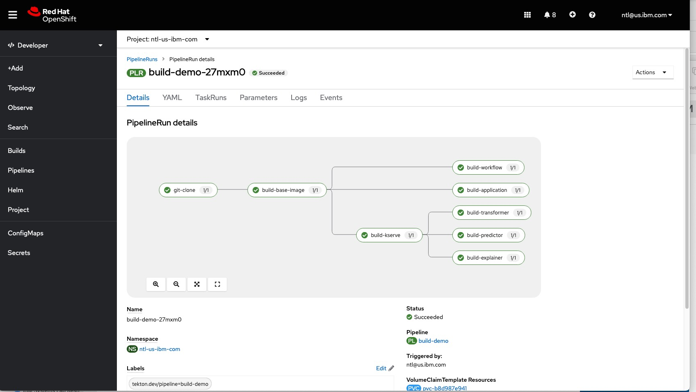

# Build container images and deploy to quay.io
If it is necessary to rebuild the container images for this demo, they can be built using OpenShift Pipelines.

1. Log on to the openshift console
1. Using the developer view, choose "Pipelines" from the left bar
1. Set the project in the top drop down to your namespace
1. Use the create drop down on the top right to create a pipeline
1. In "configure via", select "yaml view"
1. Replace the yaml template with the material in `pipeline-build-demo.yaml`
   1. This template has an additional annotation to disable Istio Injection, the annotation is required to co-exist with Kubeflow.
   1. In the metadata section of the template, update the namespace to be the current project
1. Navigate back to the "configure via pipeline builder" view
1. Change the quay.io repository URLs, github repo, and git-tag parameters so that they are correct for your use case
1. Create the pipeline
1. From the drop down, Run the pipeline
   1. Adjust any parameters as needed
   1. You will need to create a secret with your quay.io credentials
      1. Under advanced Options, create a secret
         1. Name the secret quay.io
         1. Access to `Image Registry`
         1. Authentication type `Basic Authorization`
         1. Server URL `https://quay.io`
         1. Provide User Name
         1. Provide Password
         1. Click the check mark
   1. Start the pipeline
   

When the pipeline has finished, the pipeline run will look like this:

        

The container images have been uploaded to quay.io.

If a component fails, you can click on the component and view the logs. Once the problem has been resolved, the pipeline can be re-run.

The yaml `pipeline-build-application-only.yaml` defines a pipeline that builds only the application container. This is helpful when making minor changes to the application, the application container will build very quickly if the based on containers have already been built. Building only the application allows faster iteration during development of the app.